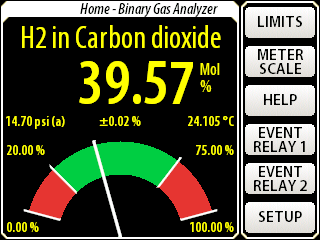
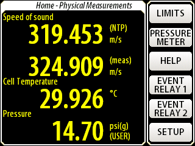
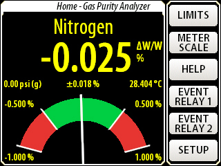
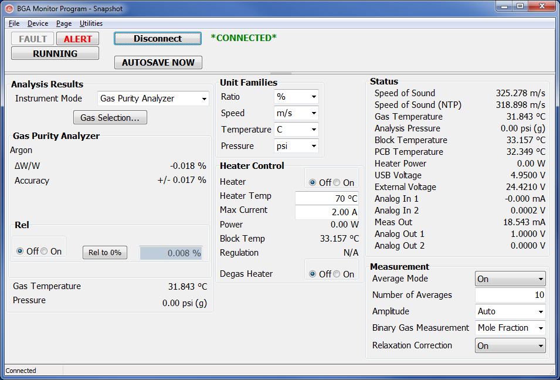
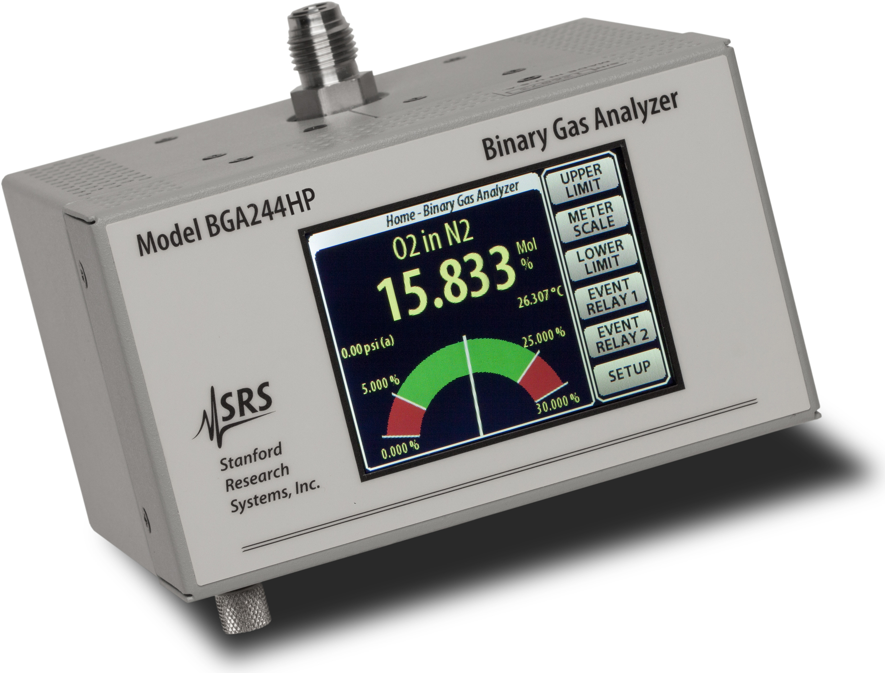
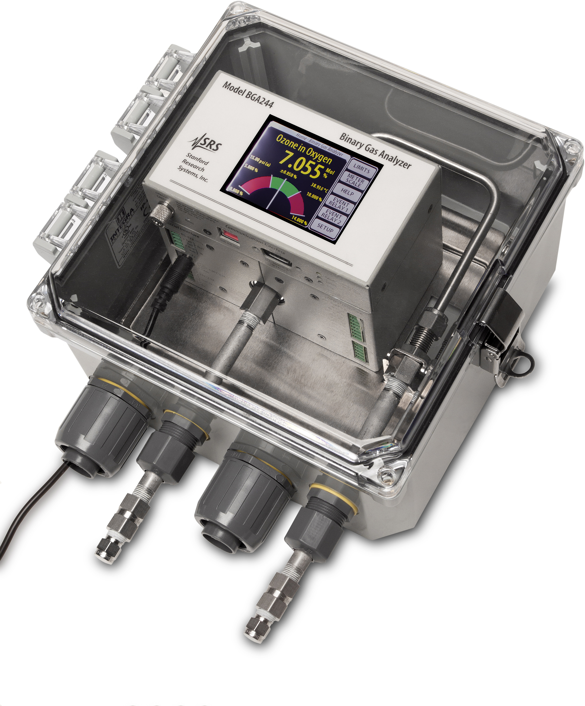

The BGA244 Binary Gas Analyzer rapidly determines the ratio of gases and vapors in a binary mixture using acoustic resonance measurements. The instrument operates without lasers, filaments, chemical sensors, optical sources, separation columns, reference gases, or reagents, and runs virtually maintenance-free.

### Principle of Operation

The BGA244 measures the speed of sound and temperature within a gas mixture. Using known thermodynamic properties and molar masses for nearly 500 gases, it determines the composition with an accuracy of about 0.1%. Three measurement modes are available: Binary Gas Analyzer mode reports the ratio of two gases; Gas Purity Analyzer mode reports the purity of a single gas; and Physical Measurements mode reports speed of sound, temperature, and gas pressure directly.

### Comprehensive Gas Database

The BGA244 contains thermodynamic and molar mass data for nearly 500 gases, enabling measurement of tens of thousands of binary gas mixtures. Gas selection is via touchscreen display or remote interface using gas name, molecular formula, or CAS number. Users can add custom gases and pseudo-gases (user-defined mixtures) for specialized applications.

### Remarkable Accuracy

Composition accuracy depends on the speed-of-sound differences between the two gas species. Typical composition errors range from 0.002% to 0.29% across common gas pairs. With relative calibration to the dominant species, accuracy can reach 10 ppm depending on gas type. Large numeric readouts and needle graphs show measured parameters and user-defined operating ranges.

### Heaters, Relays & Analog I/O

The BGA244 includes multipurpose analog I/O ports (three outputs, two inputs) configurable for 0–5 V, 0–10 V, or 4–20 mA. Two user-defined event relays support process control and alarms. Optional cavity heaters regulate measurement cell temperature and prevent condensation, with set temperature range 0 °C to 70 °C and power limit configurable from 0.5 W to 60 W.

### Remote Communication

Standard RS-232, RS-422, and USB interfaces allow remote configuration and querying of all instrument functions. The included BGAMon Windows software records and displays time-based gas composition, temperature, and pressure, and supports simultaneous management of multiple BGA244 units.

### Model Variants

The **BGA244** uses 1/8"-27 female NPT gas connectors and is available with various stainless steel adapter options. The **BGA244HP** is designed for high-purity and corrosive environments, with welded 1/4" male VCR fittings and helium leak checking. The **BGA244E** is a standard BGA244 installed in an IP66/NEMA-4X polycarbonate enclosure for dust, weather, and water protection, with a hinged clear door and wall-mount design with bottom-located gas ports and conduit fittings.

### Safety Note

The BGA244 is not ATEX rated. Under normal operating conditions the BGA244 cannot ignite the gas being analyzed. However, if the instrument is used with flammable or explosive gas mixtures we recommend the use of flame arrestors on both gas ports. The instrument's proof pressure (2,500 psia) is sufficient to contain the detonation of an explosive gas mixture of up to 30 psia. The instrument's acoustic transducer consists of a nickel-plated copper spiral on a 40 μm thick Kapton polyimide film. For gases that may react with copper or Kapton, we recommend corrosion testing of this component on a case-by-case basis.

