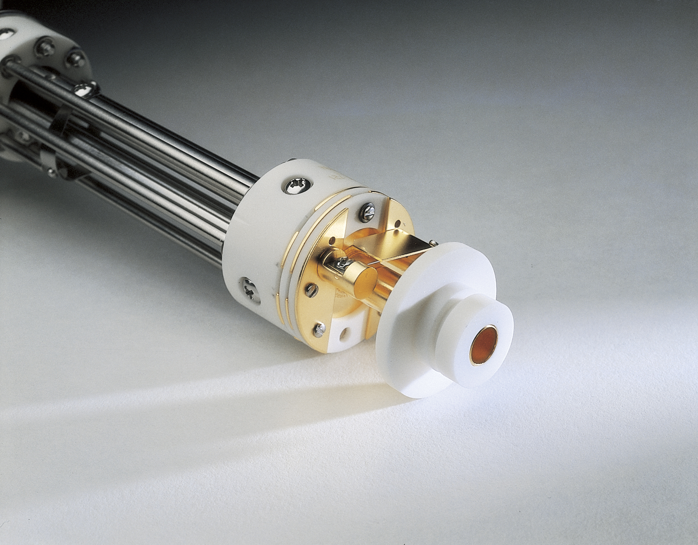
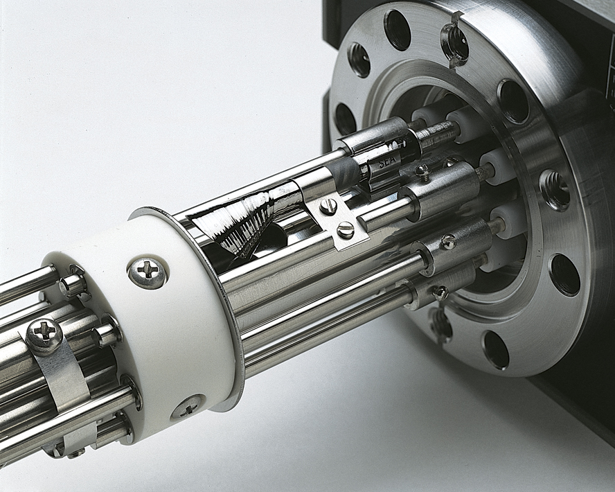
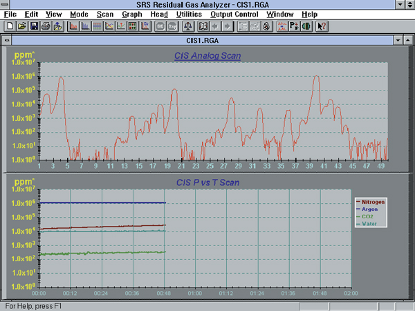
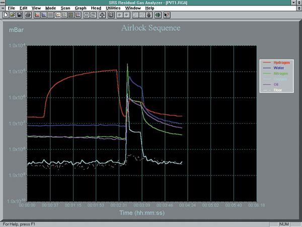
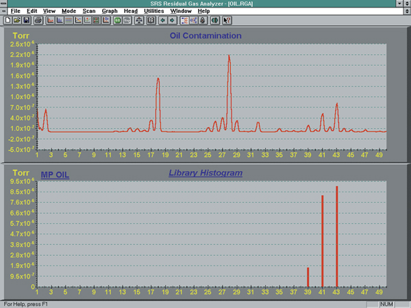
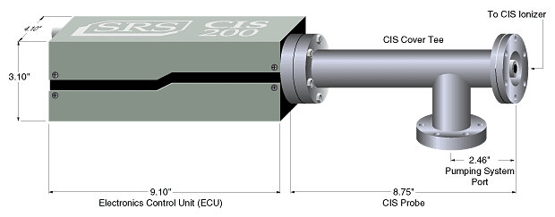

The CIS100, CIS200, and CIS300 are closed-ion-source gas analyzers designed for reactive and corrosive gas environments. Each system comes complete with a quadrupole mass spectrometer, a closed-ion-source ionizer, and real-time Windows software for data acquisition and analysis.

### Compact Design

The probe consists of a quadrupole mass spectrometer with a CIS ionizer mounted inside a 2.75" Conflat Tee. The user can replace all field-serviceable components — including the filament, electron multiplier, and ionizer — without factory assistance.

### Gold Plated Ionizer

The entire ionizer is made of gold-plated stainless steel. This reduces background signals, improves stability, and permits operation with reactive gases like WF₆ and silane.

### A Choice of Detectors

Standard equipment includes both Faraday cup (10 ppm detection) and electron multiplier detectors (1 ppm), switchable via software.

### Versatility

The CIS operates in two modes — CIS for higher pressure sampling and RGA for lower pressure vacuum analysis with different performance characteristics.

### Complete Programmability

A standard RS-232 interface is provided with full command control and custom application support.

### Windows Software

Real-time graphical interface featuring user-selectable units, programmable alarms, mass scale tuning, and data logging capabilities.

### Multi-Head Operation

Software supports up to eight analyzers monitored simultaneously.

