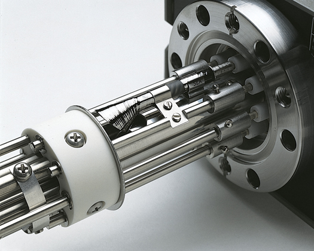
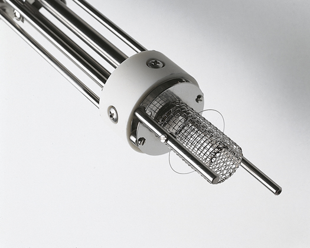
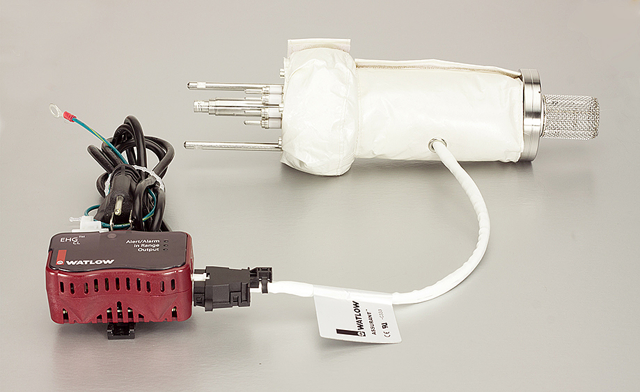
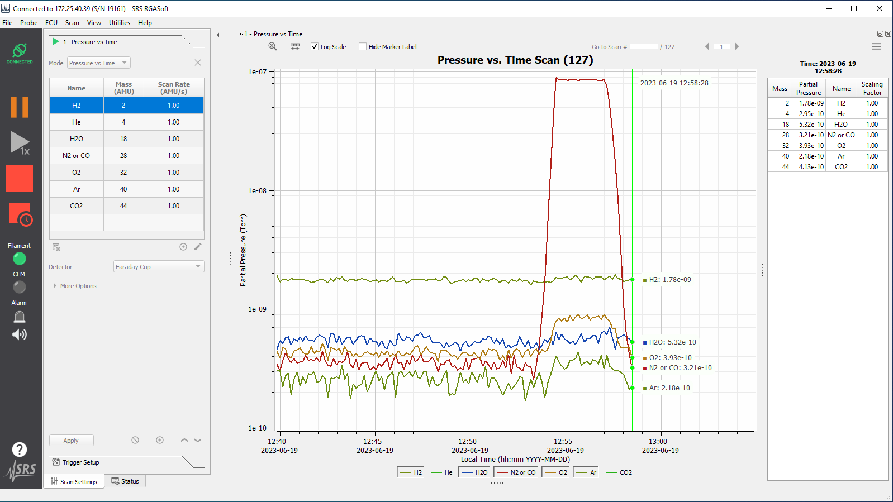
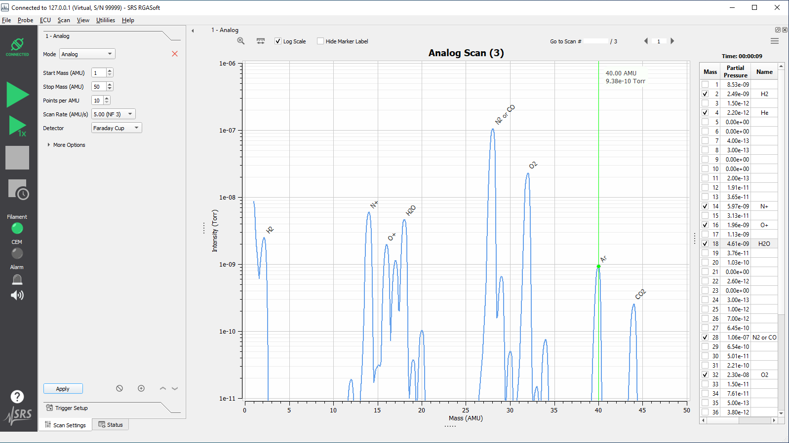
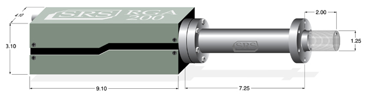

The 100, 200 and 300 amu residual gas analyzers from SRS offer exceptional performance and value. These RGA's provide detailed gas analysis of vacuum systems at about half the price of competitive models. Each RGA system comes complete with a quadrupole probe, electronics control unit (ECU), and a real-time Windows software package that is used for data acquisition and analysis, as well as probe control.

### Rugged Probe Design

The probe consists of an ionizer, quadrupole mass filter and a detector. The simple design has a small number of parts which minimizes outgassing and reduces the chances of introducing impurities into your vacuum system. The probe assembly is rugged and mounts onto a standard 2 3/4" Conflat flange. It is covered with a stainless steel tube with the exception of the ionizer which requires just 2 1/2" of clearance in your vacuum system — about that of a standard ion gauge. The probe is designed using self-aligning parts so it can easily be reassembled after cleaning.

### Compact Electronics Control Unit

The densely packed ECU contains all the necessary electronics for controlling the RGA head. It is powered by either an external +24 VDC (2.5 A) power supply or an optional, built-in power module which plugs into an AC outlet. LED indicators provide instant feedback on the status of the electron multiplier, filament, electronics system and the probe. The ECU can easily be removed from the probe for high temperature bakeouts.

### Unique Filament Design

A long-life, dual thoriated-iridium (ThO₂/Ir) filament is used for electron emission. Dual ThO₂/Ir filaments last much longer than single filaments, maximizing the time between filament replacement. Unlike other designs, SRS filaments can be replaced by the user in a matter of minutes.

### Electron Multiplier

A Faraday cup detector is standard with SRS RGA systems which allows partial pressure measurements from 10⁻⁵ to 5 × 10⁻¹¹ Torr. For increased sensitivity and faster scan rates, an optional electron multiplier is offered that detects partial pressures down to 5 × 10⁻¹⁴ Torr. This state-of-the-art continuous-dynode electron multiplier offers increased longevity and stability and can also be replaced by the user.

### Heater Jacket

The O100HJRW Heater Jacket comes with a Watlow EHG SL10 Process Controller that provides a preprogrammed temperature of 210 °C (±3 °C). The Heater Jacket is made using PTFE (Teflon) construction, suitable for clean room applications due to its low out-gassing and particle free operation.

### Useful Features

All RGAs have a built-in degassing feature. Using electron impact desorption, the ion source is thoroughly cleaned, greatly reducing the ionizer's contribution to background noise. A firmware driven filament protection feature constantly monitors for over pressure. If over pressure is detected, the filament is immediately shut off, preserving its life. A unique temperature-compensated, logarithmic electrometer detects ion current from 10⁻⁷ to 10⁻¹⁵ Amps in a single scan with better than 2 % precision.

### Complete Programmability

Communication with computers is made via the RS-232 interface. Analog and histogram (bar) scans, leak detection and probe parameters are all controlled and monitored through a high-level command set.

### RGA Windows Software

The RGA systems are supported with a real-time software package that runs on Windows OS computers. The intuitive graphical user interface allows measurements to be made quickly and easily. Data is captured and displayed in real-time or scheduled for acquisition at a given time interval for long-term data logging. Features include common gas labels, programmable audio and visual alarms, expandable library, composition analysis, and comprehensive on-line help. The software also allows complete RGA control with easy mass scale tuning, sensitivity calibration, ionizer setup, and electron multiplier gain adjustment.

