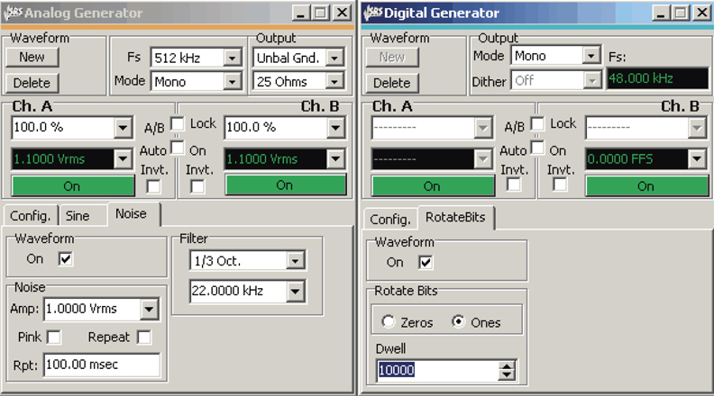
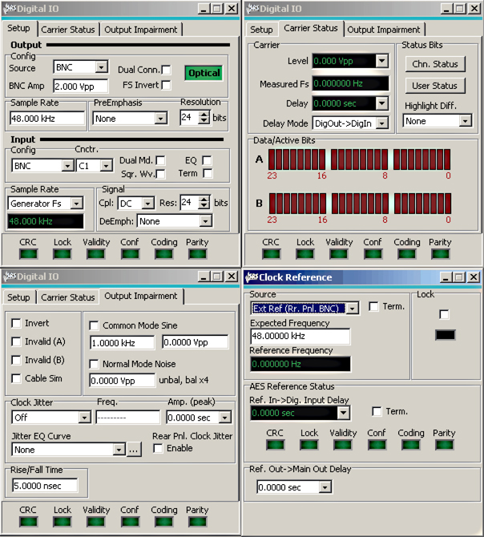
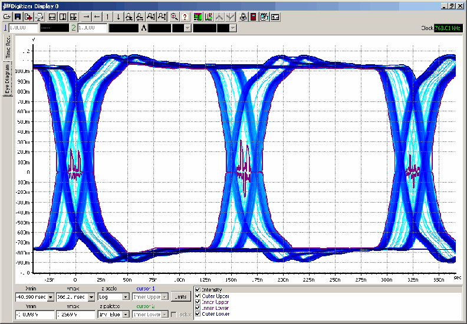

The SR1 Dual-Domain Audio Analyzer is a stand-alone instrument that delivers cutting edge performance in a wide variety of audio measurements. It combines a versatile generator with analyzers operating in both analog and digital domains, supporting sampling rates up to 192 kHz for digital audio carrier measurements.

### User Interface

The SR1 runs Windows XP embedded, offering familiar operation via external peripherals or front-panel controls. Seven tabbed pages allow flexible screen arrangement with configurations saveable to internal storage or USB drives. The QuickMeas feature streamlines common audio measurements like level, SNR, frequency response, and crosstalk through simple setup questions, delivering clear result reports.

### Analog Signal Generator

At the heart of SR1 is a uniquely flexible analog signal generator supporting standard waveforms including sine, chirp, burst sine, noise variants, intermodulation test signals, square waves, and arbitrary waveforms. Multiple waveforms combine for unlimited test possibilities. Performance metrics include ±0.008 dB flatness (20 Hz to 20 kHz) and residual THD+N of −106 dB. Multitone waveforms accommodate up to 50 tones with real-time calculation, while FFT Chirp automatically synchronizes with the FFT analyzer.

### Digital Audio Signal Generator

Nearly all analog waveforms appear in the digital generator with additional digital test waveforms. Output sampling adjusts continuously from 24 kHz to 216 kHz across single and dual connectors. Complete control extends to status bits, user bits, and validity bits. Carrier impairments include variable rise time, common mode sine waves, normal mode noise, and multiple jitter waveforms.

### Timebase

All of SR1's sampling clocks are derived from an internal timebase with 5 ppm accuracy. An optional atomic rubidium timebase offers superior long-term stability with ±5 × 10⁻¹¹ accuracy. External synchronization supports standard clocks, AES11 references, and video signals.

### Analyzers

The heart of SR1's measurement abilities is its versatile set of analyzers which operate symmetrically on both analog and digital audio signals with no need to purchase additional options. Up to two analyzers can operate simultaneously on either input type. The Time Domain Detector performs standard audio measurements with bandwidth limiting and weighting filters. FFT analyzers provide live spectral displays with zoom and heterodyne capabilities. Dual-channel FFT enables single-shot frequency response measurements. Additional analysis options include THD, IMD, histogram, and multitone analyzers.

### Digital Audio Interface

SR1 provides a complete set of measurements for digital interface testing. Direct measurements of carrier level, sampling frequency, and jitter in both time and frequency domains are included. Status bit decoding supports professional and consumer formats.

### Eye Diagram

An optional 80 MHz transient digitizer (opt. 01) processes up to 2M samples, computing time records, spectra, jitter analysis, and probability distributions. Full-color eye diagrams support user-configurable limits for straightforward carrier testing.

### Automation and Programming

SR1 offers unprecedented flexibility for user scripting and remote programming. The instrument supports VBScript, Jscript, and Python scripting with complete instrument access and custom user-interface creation. A hierarchical GPIB command set operates via IEEE-488, RS-232, or Ethernet (TCP/IP VXI-11). Learning mode records keystrokes and operations, automatically converting them to VB or Jscript programs for future execution and editing.
