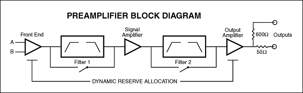
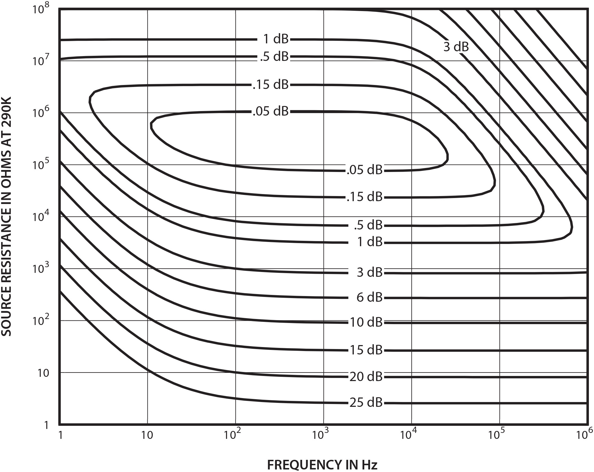
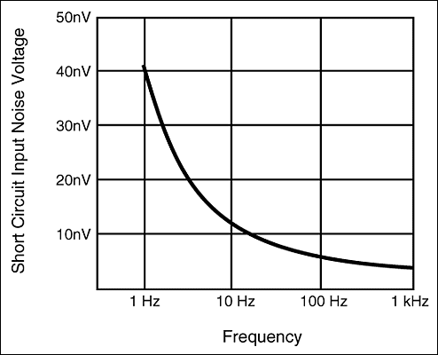

The SR560 is a high-performance, low-noise preamplifier ideal for low-temperature measurements, optical detection, and audio engineering. Its 4 nV/√Hz noise floor and 1 MHz bandwidth make it the laboratory standard for sensitive voltage amplification.

### Inputs

The SR560 has a differential front end with 4 nV/√Hz input noise and an input impedance of 100 MΩ. The inputs are fully floating — BNC shields are not connected to chassis ground. Both the amplifier ground and chassis ground are available on the rear panel for flexible grounding. Input offset nulling is accomplished by a front-panel potentiometer.

A rear-panel TTL blanking input lets you quickly gate the gain off and on, useful for preventing front-end overloading. The gain turns off within 5 μs of the TTL going high and recovers within 10 μs of the TTL going low.

### Outputs

Two insulated BNC connectors provide 600 Ω and 50 Ω outputs, both capable of driving 10 Vpp into their respective loads. Two rear-panel power supply outputs provide ±12 VDC at up to 200 mA, referenced to amplifier ground — clean DC bias for sensors and transducers.

### Gain

Gain is selectable from 1 to 50,000 in a 1-2-5 sequence, with a vernier adjustment providing 0.5% resolution within each step. Gain can be allocated before the filters for lowest noise, or after the filters for highest overload resistance (High Dynamic Reserve mode).

### Filters

The SR560 contains two independent first-order RC filters, each configurable as low-pass or high-pass from the front panel. Together they can be used as a 6 or 12 dB/oct LP or HP filter, or as a 6 dB/oct bandpass filter. Cutoff frequencies are settable in a 1-3-10 sequence from 0.03 Hz to 1 MHz. A filter reset button shortens recovery time when using long time constants.

### Battery Operation

Three internal rechargeable lead-acid batteries provide up to 15 hours of operation. The internal charger automatically adjusts charging rate based on battery state; two rear-panel LEDs indicate charge status. Depleted batteries are automatically disconnected from the amplifier circuit to prevent damage.

### No Digital Noise

The microprocessor is kept in sleep mode except during the brief interval required to change instrument settings. This ensures that digital switching noise never contaminates low-level analog signals.

### RS-232 Interface

The RS-232 interface provides listen-only remote control at 9600 baud. Up to four SR560s can be controlled from a single port, each assigned a unique address via the LALL command. All front-panel functions except power-on are remotely controllable. The RS-232 electronics are opto-isolated from the analog circuitry for maximum noise immunity.
