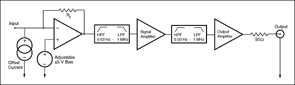
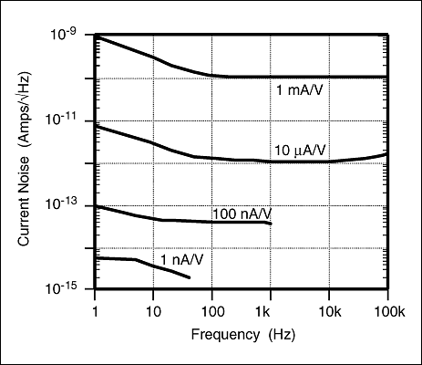
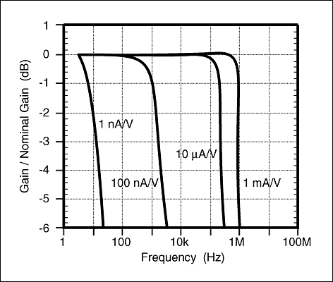
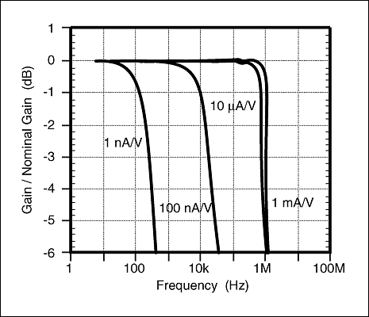
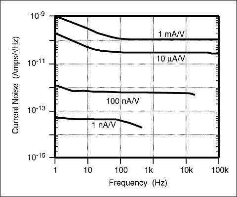

The SR570 is a low-noise current preamplifier capable of current gains as large as 1 pA/V. High gain and bandwidth, low noise, and many convenient features make the SR570 ideal for a variety of photonic, low-temperature, and other measurements.

### Gain

The SR570 has sensitivity settings from 1 pA/V to 1 mA/V selectable in a 1-2-5 sequence. A vernier gain adjustment provides continuous sensitivity selection in 0.5% increments within each step.

Gain can be allocated to various stages of the amplifier to optimize performance. In Low Noise mode, gain is placed in the front end for best noise performance. In High Bandwidth mode, gain is shifted to later stages to improve the front-end frequency response. In Low Drift mode, the input amplifier is replaced with a very low input-current op amp, reducing DC drift by up to a factor of 1000 at high sensitivity settings.

### Filters

The SR570 contains two independent first-order RC filters configurable as low-pass or high-pass from the front panel. Together they provide 6 or 12 dB/oct LP or HP filtering, or a 6 dB/oct bandpass response. Cutoff frequencies are settable in a 1-3-10 sequence from 0.03 Hz to 1 MHz. A filter reset button shortens overload recovery time when long time constants are used.

### Input Offset and DC Bias

An input offset-current adjustment suppresses undesired DC background currents. Offset currents are specifiable from ±1 pA to ±1 mA in 0.1% increments. An adjustable input DC bias voltage (±5 V) lets you sink current into a virtual null (analog ground) or a user-set DC bias point.

### Toggle and Blanking

Two rear-panel opto-isolated TTL inputs provide additional control. A blanking input turns the gain off and on to prevent front-end overloading. A toggle input inverts the sign of the gain in response to a TTL signal, enabling synchronous detection with a chopped signal.

### Battery Operation

Three rechargeable lead-acid batteries provide up to 15 hours of operation. The internal charger senses battery state and adjusts charging rate accordingly; two rear-panel LEDs indicate charge status. Depleted batteries are automatically disconnected from the amplifier circuit to prevent damage.

### No Digital Noise

The microprocessor is kept in sleep mode except during the brief interval required to change instrument settings. This ensures that digital switching noise never contaminates low-level analog signals.

### RS-232 Interface

The RS-232 interface provides listen-only remote control at 9600 baud. All front-panel functions except power-on are remotely controllable. The RS-232 electronics are opto-isolated from the analog circuitry for maximum noise immunity.

### Performance

