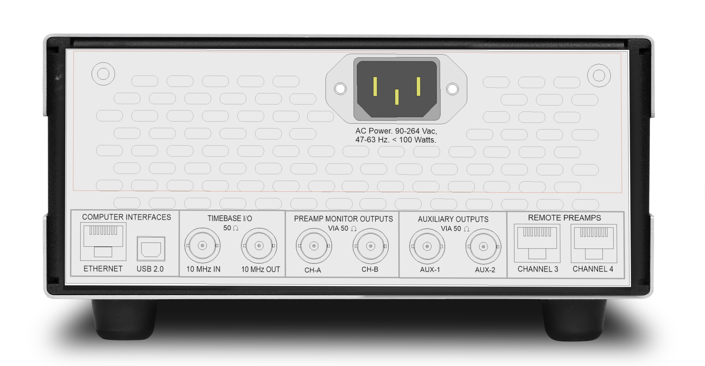

The SR835 is built on a fundamentally new architecture: synchronous sampling. A fractional-N clock synthesizer with sub-picosecond jitter locks the ADC and DDS clocks to an exact integer multiple of the reference frequency. This single innovation eliminates DDS spurs, enables synchronous filtering at any frequency, and allows time constants as short as one signal period — all without the compromises of traditional lock-in designs.

The result is a dual-channel, dual-phase lock-in amplifier covering 1 mHz to 1 MHz in a single 2U rack instrument. A dedicated 1 GHz DSP with a hardware FIR accelerator provides phase-linear digital filters that preserve signal waveshape with no overshoot and finite settling time. Two independent measurement channels share a common oscillator, enabling simultaneous two-signal measurement, harmonic detection, or vector network analysis — all without external hardware.

### Synchronous Sampling

Traditional lock-in amplifiers run their ADC and DDS clocks independently of the signal frequency. The SR835 takes a different approach: a fractional-N clock synthesizer with sub-picosecond jitter locks both clocks to an exact integer multiple of the reference. Because every sample window aligns precisely with the signal period, a simple boxcar sum over one cycle completely nulls the mixer products — no high-order filter required.

### Spur-Free Sine Output

In a conventional DDS, the output frequency is not an exact sub-multiple of the clock, producing phase-truncation spurs that can reach −70 dBc. With synchronous sampling, the DDS clock is an integer multiple of the output frequency, so every cycle of the waveform is identical. The spurs collapse underneath the fundamental and the output is spectrally clean.

### Phase-Linear Digital Filters

The SR835 replaces the cascaded RC (IIR) filters of earlier lock-in amplifiers with phase-linear FIR low-pass filters. These filters have equal group delay at all frequencies: the output preserves the true time-domain shape of the input signal with no waveform distortion, no overshoot, and an impulse response that settles to exactly zero — eliminating the long exponential tails of RC filters.

### Synchronous Filter

Because sampling is synchronous, a boxcar FIR that sums over exactly one signal period acts as a perfect comb filter, placing nulls at every harmonic. Unlike older sync filters that worked only at low frequencies, this provides ≥80 dB rejection of mixer products across the full 1 mHz to 1 MHz range.

### Redesigned Inputs

A fully differential input topology features a precision JFET front-end stage with 2 nV/√Hz input noise and an input impedance of 10 MΩ. Inputs are fully floating, with an optional chassis ground connection. A rear-panel single-ended input provides 1 nV/√Hz noise for the lowest possible noise floor. Inputs are fully protected against overvoltage events.

### Dual-Channel Measurement

Two independent measurement channels share a common oscillator. Each channel computes X and Y simultaneously with true quadrature outputs. The channels can be configured for simultaneous two-signal measurement, harmonic detection at different harmonics, dual-reference detection, or vector network analysis (ratio measurement).

### Scan Engine and Data Capture

Frequency, amplitude, offsets, or auxiliary outputs can be swept between limits using linear or logarithmic spacing. The capture buffer holds up to one million points. Demodulated data can be streamed continuously over Ethernet or USB for real-time use.

### Front-Panel Touchscreen

All functionality is exposed through a modern touchscreen interface. Parameters are organized hierarchically with physical increment buttons for fine control.

