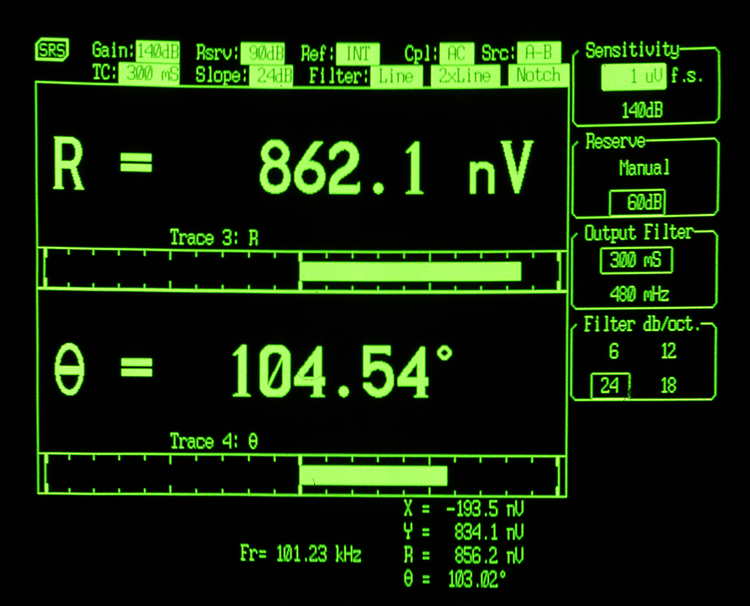
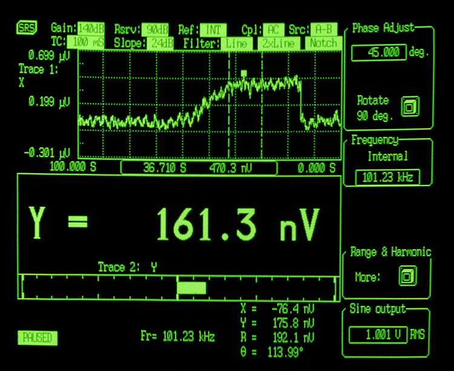
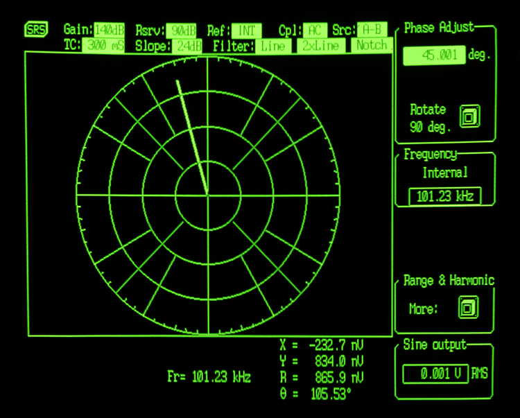

The SR850 is a digital lock-in amplifier based on an innovative DSP (Digital Signal Processing) architecture. The SR850 boasts a number of significant performance advantages over traditional lock-in amplifiers — higher dynamic reserve, lower drift, lower distortion, and dramatically higher phase resolution. In addition, the flat panel display and 65,536 point memory make it possible to display and process data in a variety of formats unavailable with conventional lock-ins.

### Digital Precision

At the input of the SR850 is a precision 18-bit A/D converter which digitizes the input signal at 256 kHz. The A/D converter, together with a high-speed DSP chip, replace the analog demodulator (mixer), low-pass filters and DC amplifiers found in conventional lock-ins. Instead of using analog components, the SR850 is implemented by a series of precise mathematical calculations which eliminate the drift, offset, nonlinearity and aging inherent in analog components. The same DSP chip digitally synthesizes the reference oscillator, providing a source with less than −80 dBc distortion, 100 mHz frequency resolution, and 2 mV of amplitude resolution.

### Digital Flexibility

The SR850's display supports a large selection of options. Data can be viewed numerically or graphically in bar graph, polar plot and strip chart formats. With 65,536 points of memory and data acquisition rates up to 512 Hz, you are able to see exactly how your data changes in time — not just what the current output value is. After the data has been acquired, the SR850 offers a variety of data reduction options, such as Savitsky-Golay smoothing, curve-fitting and statistical analysis. Standard RS-232 and GPIB interfaces make it easy to transfer data to your computer.

### Input Channel

The SR850 has a differential input with 6 nV/√Hz input noise. The input impedance is 10 MΩ, and minimum full-scale input voltage sensitivity is 2 nV. The input can also be configured for current measurements with selectable current gains of 10⁶ and 10⁸ V/A. A line filter (50 Hz or 60 Hz) and a 2× line filter (100 Hz or 120 Hz) are provided to eliminate line related interference. However, unlike conventional lock-in amplifiers, no tracking band-pass filter is needed at the input of the SR850. The DSP based design of the SR850 has such inherently large dynamic reserve that no tracking band-pass filter is needed.

### Reference Channel

The reference source for the SR850 can be an externally applied sine wave or square wave, or its own digitally synthesized reference source. Because the internal reference source is synthesized from the same digital signal that is used to multiply the input, there is virtually no reference phase noise when using the internal reference. The internal reference can operate at a fixed frequency or can be swept linearly or logarithmically over the entire operating range of 1 mHz to 102.4 kHz. Harmonic detection can be performed at any integer harmonic of the reference frequency — not just the first few harmonics. The DSP approach also offers considerable advantages when working with an external reference. The time to acquire an external reference is only 2 cycles + 5 ms (or 40 ms, whichever is greater) — about ten times faster than conventional lock-ins. Because the SR850 uses a digital phase-shifting technique rather than analog phase-shifters, the reference phase can be adjusted with one millidegree resolution. In addition, the X and Y outputs are orthogonal to within one millidegree.

### Outputs and Time Constants

The output time constants on the SR850 are implemented digitally. Low-pass filter rolloffs of 6, 12, 18 and 24 dB/octave are available with time constants ranging from 10 µs to 30 ks. Below 200 Hz, the SR850 can perform synchronous filtering. Synchronous filters notch out multiples of the reference frequency — an especially useful feature at low frequencies where the proximity of the 2f component would otherwise require a long time constant for effective filtering. The SR850 makes working at low frequencies a far less time consuming task.

### High Dynamic Reserve

The dynamic reserve of a lock-in amplifier at a given full-scale input voltage is the ratio (in dB) of the largest interfering signal to the full-scale input voltage. The SR850 has the highest dynamic reserve (100 dB) of any lock-in available. In conventional lock-in amplifiers, dynamic reserve is increased at the expense of stability. Because of the digital nature of the filtering and gain process in the SR850, the ultra-high dynamic reserve is obtained without any sacrifice in stability or accuracy. In addition, the SR850's high dynamic reserve is obtained without the use of analog band pass filters, eliminating the noise and error that such filters introduce.

### Traces and Displays

Data acquired by the SR850 is stored in up to four user-defined traces. Each trace can be configured as (A×B)/C, where A, B and C are selected from X, Y, R, Θ, noise, frequency or any of the four rear-panel auxiliary inputs. Common operations, such as ratioing, can be performed in real time by defining an appropriate trace. Trace values can be displayed as a bar graph with an associated large numerical display, or as a strip chart showing the trace values as a function of time. Additionally, you can display polar plots showing the phasor formed by the in-phase and quadrature components of the signal. All displays can be easily scaled from the front panel or over the computer interfaces, and an autoscale feature is available to quickly optimize the display. The screen can be configured as a single large display, or as two horizontally-split displays.

### Convenient Auto Measurements

Common measurement parameters are available as single-key "auto" functions. The gain, phase, dynamic reserve and display scaling can all be set with a single key press. For many measurements, the instrument can be completely configured simply by using the auto functions.

### Auxiliary A/Ds and D/As

Four rear-panel A/D inputs allow you to measure external signals with millivolt resolution. The measured values can be incorporated into one of the SR850's trace definitions, or can be displayed on the front panel, or read via either computer interface. Four D/A outputs can provide either fixed output voltages or a voltage level which scans synchronously with the SR850's frequency scans. Both the A/D inputs and the D/A outputs have a ±10 V range.

### Analysis Features

The SR850's performance doesn't stop once data has been acquired — a full set of data processing features is also included. Multiple-range Savitsky-Golay smoothing can be applied to any of the trace arrays, and statistical information (mean, variance, sum) can be calculated for a selected trace region. A curve fitting routine calculates best fits to lines, exponential curves, and Gaussian curves for any portion of your data. And a trace "calculator" lets you perform a variety of simple arithmetic and trigonometric operations on trace data.

### Interfaces and Hardcopies

The SR850 comes standard with RS-232 and GPIB interfaces. All instrument functions can be queried and controlled via the interfaces. Several hardcopy options are available on the SR850. Screens can be dumped to a dot-matrix or LaserJet compatible printer through the standard Centronics printer interface. Displays can also be plotted on any HP-GL compatible plotter via GPIB or RS-232.
